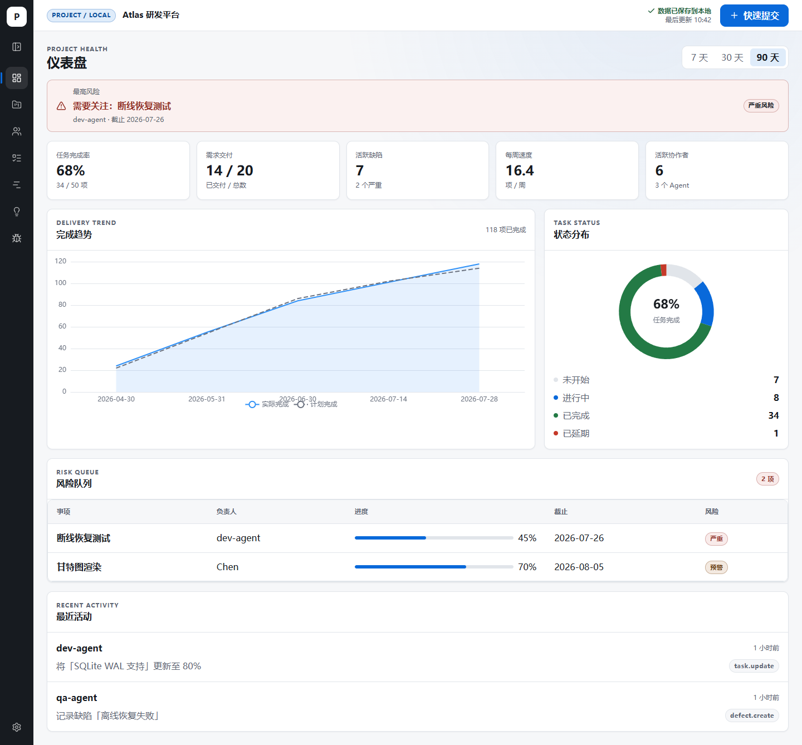

# Project OS — 本地项目管理与 Agent 协作

[中文](README.md) | [English](README_EN.md)

## v1.0.0 正式版

Project OS 首个完整版本现已就绪，覆盖项目组合与负责人筛选、项目内任务、
人员与 Agent 目录、快速进度提交、可配置设置页，以及共享 SQLite 数据的
REST、MCP 和 Agent Skill 协作链路。完整改动与已知限制见
[CHANGELOG](CHANGELOG.md)。

Project OS 是一个本地优先的项目工作台。React Web、REST API、SQLite、
MCP 服务器和可安装的 Agent Skill 共享同一套数据与权限规则。当前版本支持：

- 所有项目总览、按负责人筛选、新建项目和项目内新建任务；
- 人员与 Agent 负责人目录、任务快速提交、需求、缺陷、甘特图和仪表盘；
- 外观、数据、MCP 令牌和 Agent Skills 设置；
- Codex、Claude Code、Kimi Code 的 stdio 接入，以及 `/mcp` Streamable HTTP；
- SQLite 持久化、备份恢复和 JSON 导入导出。

> 本项目适合本机或受信任网络中的单实例使用。它没有用户登录、多租户隔离或
> TLS 终止能力。远程监听前必须先配置访问令牌、主机白名单、来源白名单和外部
> TLS 反向代理。



## 环境要求

- Node.js 24 或更高版本
- npm
- 首次运行浏览器测试时需要 Playwright Chromium

安装锁定依赖：

```bash
npm ci
```

## 本地开发

```bash
npm run dev
```

该命令同时启动：

- API 与 `/mcp`：`http://127.0.0.1:4310`
- Vite Web：通常为 `http://localhost:5173`

Vite 会把 `/api` 代理到本地 API。`Ctrl+C` 会监督式关闭两个进程。默认数据库
为 `data/project_manage.db`，首次启动会自动迁移并写入幂等演示种子。

## 构建与启动

```bash
npm run build
npm start
```

`npm run build` 校验 TypeScript 并生成 `web/dist/` 和
`apps/mcp/dist/stdio.js`。`npm start` **只启动 API 与 MCP HTTP 服务**，它不会
托管 `web/dist/`。如需独立运行 Web 生产构建，请用静态服务器托管
`web/dist/`，为 SPA 配置 `index.html` 回退，并把 `/api` 反向代理到 API。

服务器默认环境变量：

| 变量 | 默认值 | 用途 |
|---|---|---|
| `PROJECT_OS_HOST` | `127.0.0.1` | API/MCP 监听地址 |
| `PROJECT_OS_PORT` | `4310` | API/MCP 端口 |
| `PROJECT_OS_DATABASE_PATH` | `data/project_manage.db` | REST 服务数据库 |
| `PROJECT_OS_BACKUP_ROOT` | `data/backups` | 备份目录 |
| `PROJECT_OS_ALLOWED_HOSTS` | 空 | 非回环监听时必填的 Host 白名单 |
| `PROJECT_OS_ALLOWED_ORIGINS` | 空 | 允许的精确 HTTP/HTTPS Origin |
| `PROJECT_OS_LOCAL_ACTOR_ID` | `actor_local_owner` | Web 本地操作者 |

相对路径以仓库根目录解析。stdio 还接受 `PROJECT_OS_DB`，并优先于
`PROJECT_OS_DATABASE_PATH`。

## 常用命令

所有命令均从仓库根目录执行。

| 命令 | 用途 |
|---|---|
| `npm run dev` | 启动 API 和 Web 开发环境 |
| `npm run build` | 构建/校验所有工作区 |
| `npm start` | 只启动 API 与 MCP HTTP 服务 |
| `npm test` | 运行所有单元与集成测试 |
| `npm run test:e2e` | 运行 Playwright 真实服务、可访问性和视觉测试 |
| `npm run check:docs` | 验证文档命令、链接、客户端和安全示例 |
| `npm run check` | lint、测试、构建和文档门禁 |

首次运行 E2E：

```bash
npx playwright install chromium
npm run test:e2e
```

## MCP 与 Agent Skill

Project OS 暴露 22 tools。两种连接方式使用相同服务层和 SQLite 数据：

- stdio：`apps/mcp/dist/stdio.js`，适合本机 Codex、Claude Code 和 Kimi Code；
- Streamable HTTP：`http://127.0.0.1:4310/mcp`，适合支持该传输的客户端。

设置页的 MCP 区域可以签发和撤销令牌。明文只显示一次；服务端只保存摘要。
回环监听不强制令牌，非回环监听的 REST 与 MCP 写读请求都需要有效 Bearer
令牌（`/api/v1/health` 除外）。

完整的三客户端配置、Skill 安装、验证副作用与排障见
[Agent 接入指南](docs/agent-setup.md)。

默认连接验证不会调用业务 tools，因而不会写入 Agent、项目、任务或活动；但
stdio 启动会打开指定 SQLite，可能创建父目录、数据库、WAL 并执行迁移。
需要完全隔离文件影响时，请给验证命令传入临时 `--database` 路径。

## 数据与备份

设置页可以创建/恢复 SQLite 备份、导出 JSON、导入 JSON。恢复和导入会替换
当前数据，操作前应创建备份；JSON 导出不包含访问令牌。

路径、格式、恢复流程与灾难恢复说明见
[数据与备份指南](docs/data-and-backups.md)。

## 发布状态

自动化与真实客户端证据、已知限制和重试命令见
[发布检查清单](docs/release-checklist.md)。只有三客户端证据的每个字段都为
`true`，版本才可描述为“三客户端完全验收”。

当前候选版本**尚未达到三客户端完全验收**：隔离 smoke 中 Codex 受
`spawn EPERM` 阻断，Claude 因没有可安全隔离的凭据而未发起模型调用；
Kimi Code 已在隔离临时 HOME 中完成工具发现、身份注册、项目读取、进度写入
和活动核对，全部字段通过且没有改变全局客户端配置。服务端、工具合约和浏览器
自动化通过不等于所有真实模型客户端都已完成写入验收。

## 进一步文档

- [v1.0.0 变更说明](CHANGELOG.md)
- [Web 开发说明](web/README.md)
- [Agent 接入指南](docs/agent-setup.md)
- [数据与备份指南](docs/data-and-backups.md)
- [发布检查清单](docs/release-checklist.md)
- [完整设计规格](docs/superpowers/specs/2026-07-29-project-os-full-stack-mcp-design.md)
- [实施计划索引](docs/superpowers/plans/2026-07-29-project-os-full-stack-index.md)

## 安全边界

- 不要提交令牌、数据库、备份、真实业务导出或客户端私有配置。
- `VITE_*` 会进入前端产物，不能存放秘密。
- 非回环监听必须设置 `PROJECT_OS_ALLOWED_HOSTS`；跨来源 Web 客户端还必须
  设置 `PROJECT_OS_ALLOWED_ORIGINS`。
- 外部访问必须由受信任反向代理提供 TLS、速率限制和网络访问控制。
- 当前没有开放源代码许可证；公开可见不代表自动授权复制或分发。
