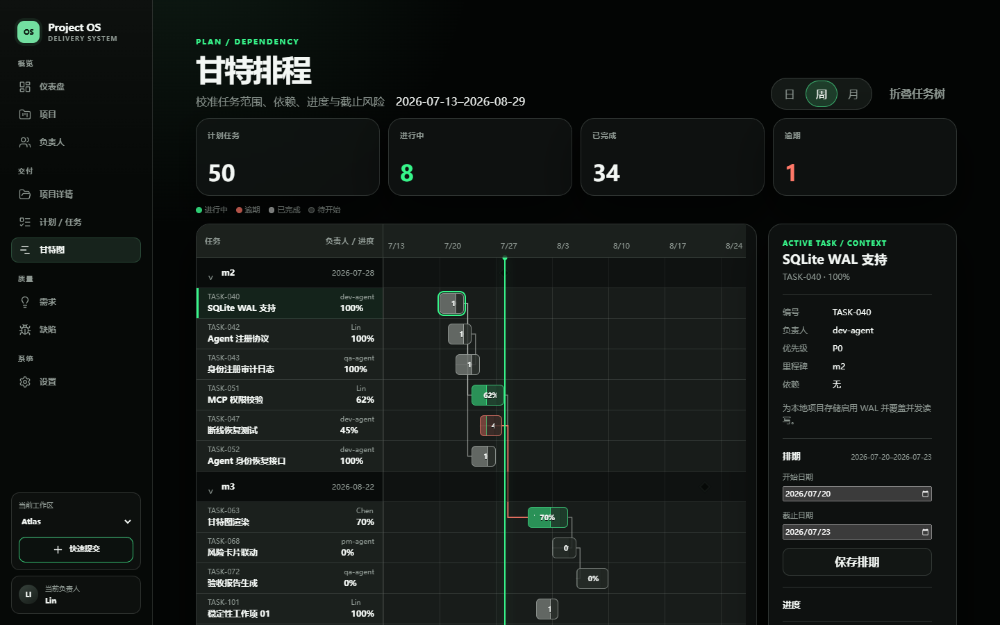

# Project Manage — Local Project Management Data War Room

[中文](README.md) | [English](README_EN.md)

A local project-management frontend prototype for individual developers, small teams, and AI agents. Its “Data War Room” interface brings project health, tasks, Gantt planning, requirements, defects, and agent activity into one dense but readable workspace.

> [!IMPORTANT]
> This release is a runnable frontend prototype, not a production project-management service. Data comes from an in-browser, in-memory mock repository and returns to the initial demo state after a page refresh. There is currently no backend, database, login, authorization, or real-time multi-user collaboration. Do not enter real sensitive data or expose the application directly to a production network.


## Features

- Data War Room dashboard with project health, delivery trends, status distribution, a risk queue, and an activity feed.
- Task workbench with status, assignee, and priority filters, plus a task inspector and progress updates.
- Gantt view with a task tree, timeline, today marker, milestones, and dependencies.
- Requirement lifecycle board with review, development, and delivered columns, including drag-and-drop and keyboard-accessible status updates.
- Defect risk queue with severity/status views and defect-to-repair-task conversion.
- Loading, empty, error, refresh-failure, and stale-data states.
- Responsive and accessible layouts for 1440, 1280, 1024, and 768 widths, with keyboard workflows and automated WCAG A/AA checks.
- A deterministic 10,000-task development mode backed by virtualized task-table and Gantt rendering.



## Technology

- React 19, TypeScript 6, and Vite 8
- React Router
- TanStack Query, TanStack Table, and TanStack Virtual
- ECharts
- dnd-kit
- Vitest, Testing Library, Playwright, and axe-core

## Requirements

- Node.js 20.19 or newer
- npm
- Git

Using the current Node.js LTS release is recommended. The repository includes `web/package-lock.json`, so prefer `npm ci` for reproducible installs.

## Installation and local development

### 1. Clone the repository

With SSH:

```bash
git clone git@github.com:wozoulesky/project_manage.git
cd project_manage/web
```

Or with HTTPS:

```bash
git clone https://github.com/wozoulesky/project_manage.git
cd project_manage/web
```

### 2. Install dependencies

```bash
npm ci
```

### 3. Start the development server

```bash
npm run dev
```

Vite normally serves the app at `http://localhost:5173`. If that port is occupied, use the URL printed in the terminal.

## Routes

| Path | Page |
|---|---|
| `/dashboard` | Dashboard |
| `/tasks` | Task workbench |
| `/gantt` | Gantt view |
| `/requirements` | Requirement lifecycle |
| `/defects` | Defect risk queue |
| `/settings` | Settings placeholder |

The root path `/` redirects to the dashboard. Unknown paths render a 404 page with a recovery link.

## Commands

Run these commands from `web/`.

| Command | Purpose |
|---|---|
| `npm run dev` | Start the development server |
| `npm run build` | Type-check and create a production build |
| `npm run preview` | Preview the generated `dist/` directory |
| `npm run lint` | Run ESLint |
| `npm run test` | Run Vitest once |
| `npm run test:watch` | Run Vitest in watch mode |
| `npm run test:e2e` | Run Playwright end-to-end and visual tests |
| `npm run check` | Run lint, unit tests, and the production build |

## End-to-end and visual testing

Install the required Chromium build before the first run:

```bash
npx playwright install chromium
```

Then run:

```bash
npm run test:e2e
```

Playwright builds the app and starts a preview server at `http://127.0.0.1:4173`. The suite covers desktop and compact layouts, keyboard workflows, accessibility scans, business workflows, and visual baselines.

The committed baselines were generated with Chromium on Windows and therefore use a `win32` filename suffix. Other operating systems, fonts, or browser-rendering environments may produce pixel differences. Review every difference manually before updating a baseline:

```bash
npm run test:e2e -- --update-snapshots
```

Do not accept bulk visual-baseline changes without inspecting the screenshots.

## 10,000-task validation mode

This mode is available only through the development server and is excluded from normal production builds.

PowerShell:

```powershell
$env:VITE_FIXTURE_MODE='large'
npm run dev
```

Bash or zsh:

```bash
VITE_FIXTURE_MODE=large npm run dev
```

Stop the server and clear the variable to return to the default demo dataset.

## Build and static deployment

```bash
cd web
npm ci
npm run build
```

The build output is written to `web/dist/`. This is a `BrowserRouter` single-page application. When deploying to Nginx, Apache, object storage, or another static host, configure unknown frontend routes to fall back to `index.html`; otherwise, directly refreshing `/tasks`, `/gantt`, or another client route will return a server-side 404.

The repository is not currently tied to a cloud platform and does not include automated deployment configuration.

## Data and product boundaries

- All project data comes from deterministic demo fixtures and an in-memory repository under `web/src/data/`.
- Task progress, requirement status, and defect conversion can update related views during the current SPA session, but a refresh or new browser session resets them.
- There is no SQLite integration, REST API, file synchronization, cloud synchronization, or persistent storage.
- There are no user accounts, authentication, authorization, backend audit service, or tenant isolation.
- Names, agents, tasks, requirements, and defects shown in the UI are demo data.
- The settings page is currently a placeholder.

Before using this project with a real team, add at least a persistent backend, migrations, authentication, an authorization model, input validation, audit logging, backups, recovery procedures, and a secure deployment design.

## Security and dependency notes

- Never commit tokens, passwords, SSH private keys, or real business data to source files, environment files, screenshots, Issues, or test fixtures.
- `VITE_*` variables are included in client bundles and must never contain secrets.
- E2E error fixtures are enabled only in test builds and are removed from ordinary production bundles.
- The project uses only React Router's client-side SPA capabilities and does not use unstable RSC APIs.
- `react-router-dom` is currently pinned to `7.18.1`. As of 2026-07-28, `npm audit` reports the high-severity [GHSA-qwww-vcr4-c8h2](https://github.com/advisories/GHSA-qwww-vcr4-c8h2) advisory. The advisory states that applications are affected only when they use unstable RSC APIs, which this project does not currently use. The patched React Router release is `8.3.0`, a major-version upgrade that requires separate evaluation and regression testing.
- Do not run `npm audit fix --force` blindly. npm currently proposes a `react-router-dom` version change that may introduce incompatibilities. Perform the upgrade on a dedicated branch and run the complete test suite.
- Run `npm run check` and `npm run test:e2e` before and after dependency upgrades.
- Run `npm audit` before releases and assess advisories against the actual code paths in use. Do not rely on automated fixes alone.

## Repository layout

```text
project_manage/
├── README.md
├── README_EN.md
├── PRD.md
├── docs/
│   └── superpowers/
│       ├── plans/
│       └── specs/
└── web/
    ├── e2e/
    ├── public/
    ├── src/
    │   ├── app/
    │   ├── components/
    │   ├── data/
    │   ├── features/
    │   └── styles/
    ├── package.json
    └── playwright.config.ts
```

## Design and implementation documents

- [Product requirements](PRD.md)
- [Visual and interaction specification (Chinese)](docs/superpowers/specs/2026-07-28-project-management-ui-design.md)
- [Frontend implementation plan (Chinese)](docs/superpowers/plans/2026-07-28-project-management-web-ui.md)

## Contributing

Reproducible bug reports and focused pull requests with verification notes are welcome. Before submitting code, run at least:

```bash
cd web
npm run check
npm run test:e2e
```

## License

This repository does not currently include an open-source license. Public visibility does not automatically grant permission to copy, modify, or redistribute the code. The repository owner should add an explicit `LICENSE` file after choosing the intended terms.
